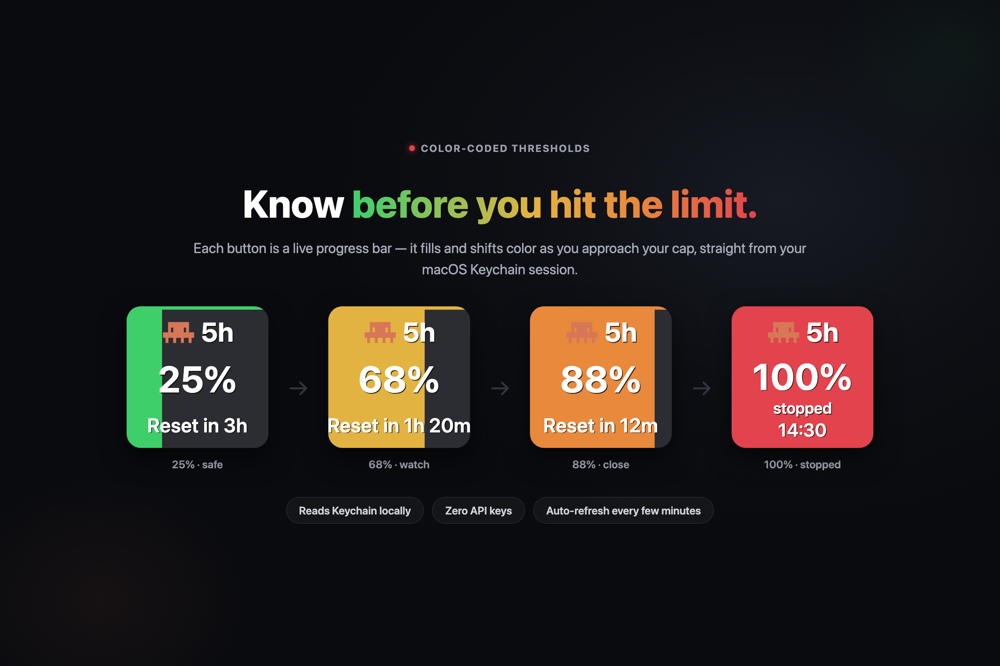

<p align="center">
  
</p>

# Claude Code Usage Plugin for Ulanzi Deck

[](https://ulanzicommunitystore.narlei.com/plugins/?plugin=narlei/ulanzideck_claude)

Display your Claude Code subscription usage directly on your Ulanzi Deck — for **one or several** Claude Code accounts at once. Runs on **macOS and Windows**.



## Features

- **5-Hour Rolling Limit** - Shows your current usage in the 5-hour window
- **Weekly Limit** - Shows your total usage across all Claude models for the week
- **Multiple instances** - Point each button at a different Claude Code config dir and read that account's usage independently
- **Accent color** - Give each button a thin colored stripe across the top so you can tell instances apart at a glance
- Real-time updates from Claude Code API
- Color-coded thresholds and reset countdown on the button

## Multiple Claude Code accounts

Each button has two settings in its Property Inspector:

- **Instance** — `Default (~/.claude)` or `Custom config dir…`. Pick *Custom* to enter a path.
- **Config dir** — the `CLAUDE_CONFIG_DIR` of the account, e.g. `~/.claude-mine`. Leave blank for the default account.
- **Accent color** — `None` or `Custom…`. Pick *Custom* and choose a color to draw a thin stripe across the top of the button.

Under the hood, where the token lives depends on the OS:

- **macOS** — the Keychain, under `Claude Code-credentials` for the default config dir, and `Claude Code-credentials-<hash>` (first 8 hex of `sha256(absolute config dir path)`) for a custom `CLAUDE_CONFIG_DIR`. The plugin computes that service name from the config dir you enter and reads the matching token.
- **Windows** — a plain `.credentials.json` file inside the config dir itself (`%USERPROFILE%\.claude\.credentials.json` by default), so pointing a button at another config dir automatically reads that account's file.

Either way, no extra setup is required. The **Config dir** field accepts `~/...` paths on both platforms, plus `%USERPROFILE%`-style environment variables on Windows.

## Installation

Download the latest release from https://ulanzicommunitystore.narlei.com/plugins/?plugin=narlei/ulanzideck_claude

## Requirements

- Ulanzi Deck 3.0.11 or later
- macOS 10.15 or later, **or** Windows 10 or later
- Claude Code CLI signed in (`claude auth login`) — no API key required

## How It Works

The plugin reads your existing Claude Code credentials (macOS Keychain on Mac, `~/.claude/.credentials.json` on Windows) and fetches your current usage from the Anthropic API. It displays:

- **Utilization %** - How much of your limit you've used
- **Reset Time** - When your limit resets (e.g. `47h`, `2d`)
- Color changes from green → yellow → orange → red as you approach the limit

Credentials are never stored by the plugin.

## Developer Setup

```bash
make install   # sync to local Ulanzi Deck plugins folder
make package   # build distributable ZIP in dist/
```

The Makefile detects the OS and targets the right plugins folder (`~/Library/Application Support/...` on macOS, `%APPDATA%\Ulanzi\UlanziDeck\Plugins` on Windows). On Windows run it from **Git Bash / MSYS2**, since the targets use a POSIX shell.

## Author

Narlei Moreira

## License

MIT
