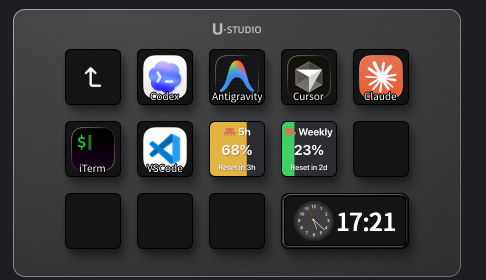

<p align="center">
  
</p>

# Claude Code Usage Plugin for Ulanzi Deck

Display your Claude Code subscription usage directly on your Ulanzi Deck.



## Features

- **5-Hour Rolling Limit** - Shows your current usage in the 5-hour window
- **Weekly Limit** - Shows your total usage across all Claude models for the week
- Real-time updates from Claude Code API
- Color-coded thresholds and reset countdown on the button

## Installation

Download the latest `.zip` from the [GitHub Releases](https://github.com/narlei/ulanzidesk_claude/releases) page, extract it, and copy the `com.claude.usage.ulanziPlugin` folder to your Ulanzi Deck plugins directory:

```
~/Library/Application Support/Ulanzi/UlanziDeck/Plugins/
```

Then restart Ulanzi Deck and add the plugin buttons to your deck.

## Requirements

- Ulanzi Deck 3.0.11 or later
- macOS 10.15 or later
- Claude Code subscription (credentials stored in your macOS Keychain — no API key required)

## How It Works

The plugin reads your Claude Code credentials from the macOS Keychain and fetches your current usage from the Anthropic API. It displays:

- **Utilization %** - How much of your limit you've used
- **Reset Time** - When your limit resets (e.g. `47h`, `2d`)
- Color changes from green → yellow → orange → red as you approach the limit

Credentials are never stored by the plugin.

## Developer Setup

```bash
make install   # sync to local Ulanzi Deck plugins folder
make package   # build distributable ZIP in dist/
```

## Author

Narlei Moreira

## License

MIT
